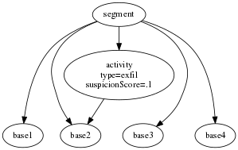
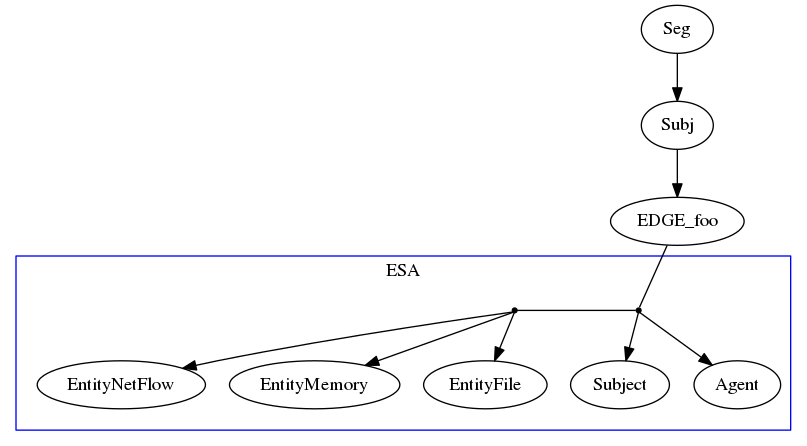

Ac annotations
--------------

These gremlin queries demonstrate Ac annotations to the DB.

Show all classification nodes with their attributes:

    g.V().hasLabel('Activity').has('activity:type').valueMap(true)

Classification counts per base node type:

    g.E().has('activity:includes').groupCount().by(label())

Selected paths from a recent segment `S` to classified base nodes:

    g.V(S).hasLabel('Segment').out().hasLabel('Activity').out().limit(2).path()

Such paths may be fed to `marker/path_expander.py`.

executing
---------

To execute the the phase3 classifier on the imagegrab trace, use `make`:

    $ cd ~/adapt/classifier/phase3/out
    $ rm -f imagegrab.bin.txt
    $ make

Several [detectors](https://github.com/GaloisInc/adapt/blob/ac-dev/classifier/phase3/classify/activity_classifier.py#L46-L50)
run during classification of each segment:

- AcrossFirewallDetector
- MarkerDetector
- ScanDetector
- SensitiveFileDetector
- UnusualFileAccessDetector

To instrument Kudu's `simple` APT application, use the supplied script:

    $ cd ~/adapt/classifier/phase3/marker
    $ ./build_instrumented_simple_apt.sh

This yields an instrumented app in `/tmp/simple` which TA1 can run
to produce a trace containing numbered begin / end markers.

events
------

The classifier needs several recorded event attributes, including:

- pid
- userID
- url
- startedAtTime (low resolution, many "simultaneous" nodes)
- sequence (essential for Happens-Before)

These are available on only a small subset of base nodes.
To bring them together
Ac [queries](https://github.com/GaloisInc/adapt/blob/377cb/tools/gremlin_event/stream.py#L88-L94)
for an ordered sequence of events matching
the Seg -> Subj -> EDGE_foo -> ESA pattern using this:

    g.V(S).hasLabel('Segment').out().hasLabel('Subject').out().out().
    has(label, within('Entity-File', 'Entity-NetFlow', 'Entity-Memory',
                      'Subject', 'Agent'))

Then the `sequence` attribute can be used to recover the original Happens-Before relationship.

TA1 sources
-----------

During the September engagement ADAPT will accept event streams from the following TA1's:

1. SRI (`ta5attack2`, `simple_with_marker_1`)
2. 5D (`imagegrab`)
3. CADETS (`remove_file`)

edge types
----------

An EDGE_foo will be one of
the [CDM13](https://git.tc.bbn.com/bbn/ta3-serialization-schema/blob/8eda8/avro/CDM13.avdl#L274)
EdgeTypes:

1.  EDGE_EVENT_AFFECTS_FILE
2.  EDGE_EVENT_AFFECTS_MEMORY
3.  EDGE_EVENT_AFFECTS_NETFLOW
4.  EDGE_EVENT_AFFECTS_REGISTRYKEY
5.  EDGE_EVENT_AFFECTS_SRCSINK
6.  EDGE_EVENT_AFFECTS_SUBJECT
7.  EDGE_EVENT_CAUSES_EVENT
8.  EDGE_EVENT_HASPARENT_EVENT
9.  EDGE_EVENT_HAS_TAG
10. EDGE_EVENT_ISGENERATEDBY_SUBJECT
11. EDGE_FILE_AFFECTS_EVENT
12. EDGE_FILE_HAS_TAG
13. EDGE_MEMORY_AFFECTS_EVENT
14. EDGE_MEMORY_HAS_TAG
15. EDGE_NETFLOW_AFFECTS_EVENT
16. EDGE_NETFLOW_HAS_TAG
17. EDGE_OBJECT_PREV_VERSION
18. EDGE_REGISTRYKEY_AFFECTS_EVENT
19. EDGE_REGISTRYKEY_HAS_TAG
20. EDGE_SRCSINK_AFFECTS_EVENT
21. EDGE_SRCSINK_HAS_TAG
22. EDGE_SUBJECT_AFFECTS_EVENT
23. EDGE_SUBJECT_HASLOCALPRINCIPAL
24. EDGE_SUBJECT_HASPARENT_SUBJECT
25. EDGE_SUBJECT_HAS_TAG
26. EDGE_SUBJECT_RUNSON
