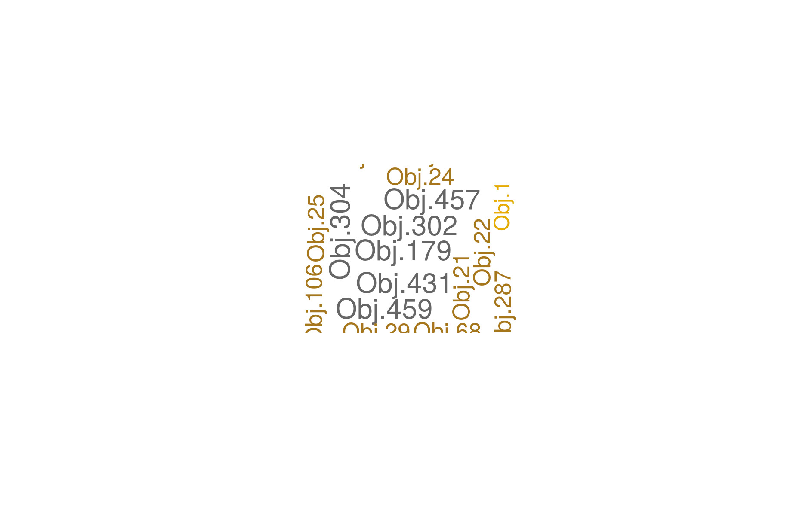

# Adapt Project

## Prerequistites
 
It is preferable to install RStudio to manage the project and execute the scripts. Although, the use of shell scripts is also possible as detailed below.
 
## Running AR-RULES MINING: 
### Data Generation and Preparation:
It is the first step of the workflow. It starts by interrogating the Neo4J database using a json specification file, and generates the formal context files with two formats: csv, and rcf.
This step can be done, either by *calling get_query.r* from RStudio, or using the bash script *extractProcessEvent.sh*. The needed information are: an input json specification file that conains the Gremlin query, an output csv file, and an output rcf file.

Example: 

*$> ./extractProcessEvent.sh*
It will create the ProcessEvent context files: *'./contexts/ProcessEventSample.csv'* and *'./contexts/PrecessEventSample.rcf'*.

We can do the same process under un R environment:

*R prompt> source("get_auery.r")*

*R prompt> get_query("JsonSpecFile"","rcf_context_file","csv_file"")*

In this first step, many other sub-modules are also available:

*process_rcf_context.r*:  this function takes as input an RCF context and generates a csv context file.

Example:

*R prompt> source("process_rcf_context.r")*

*R prompt> process_rcf_context=function(c"rcf_context_file","csv_file"")*

*csv_to_rcf.r*:  this function takes as input a csv context file and generates an RCF context.  
*load_rcf.r*:  this function takes as input an RCF context and loads a data structure in memory.

*load_csv.r*: this function takes as input a csv context and loads a data structure in memory.

*check_packages.r*: checks the needed packages.

We have also implemented the *check_csv_contexts.sh* script, which does a comparison between a reference csv file (context) and a new procuced csv file. It allows us the early detection of any abnormal format of the input data.

Example: 

*$> ./check_csv_contexts.sh*

### Data Processing:

*$> ./Context_scoring_From_CSV.sh*: is actually the second main shell that can be executed after *$> ./extractProcessEvent.sh*, since it takes a *context_name* string, a produced *csv context file*, an *rcf file*, an *output_scoring_file* and numerical values for *MinSup* and *MinConf*.

 
 ### Data Visualisation:
 
 *Rule_coloring.r* (unedr progress): generates an HTML file for coloring the rules, and a word cloud of the objects that violate rules, regarding their score.
 

