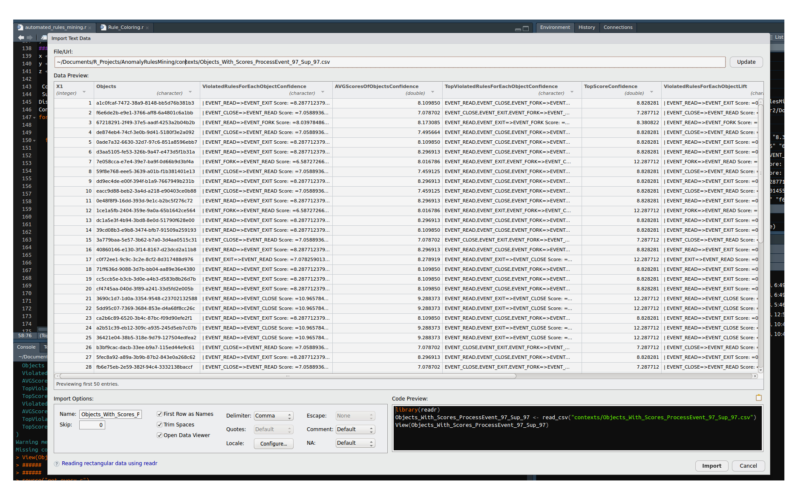
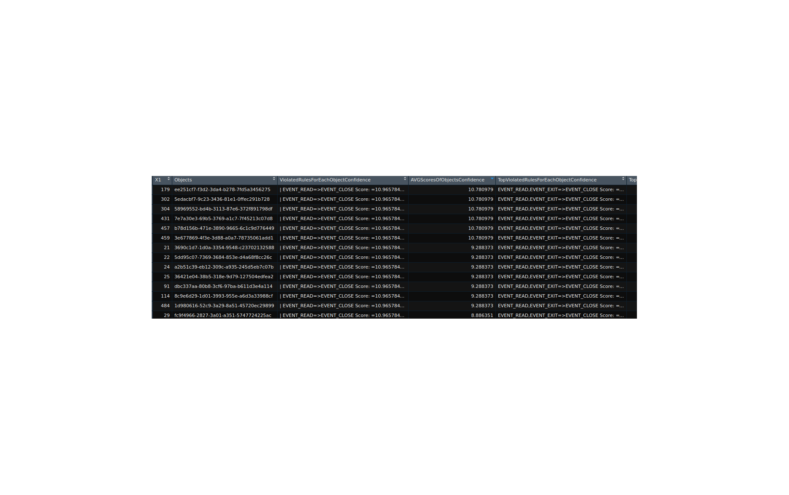
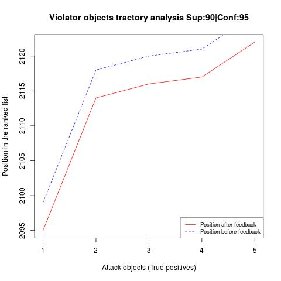
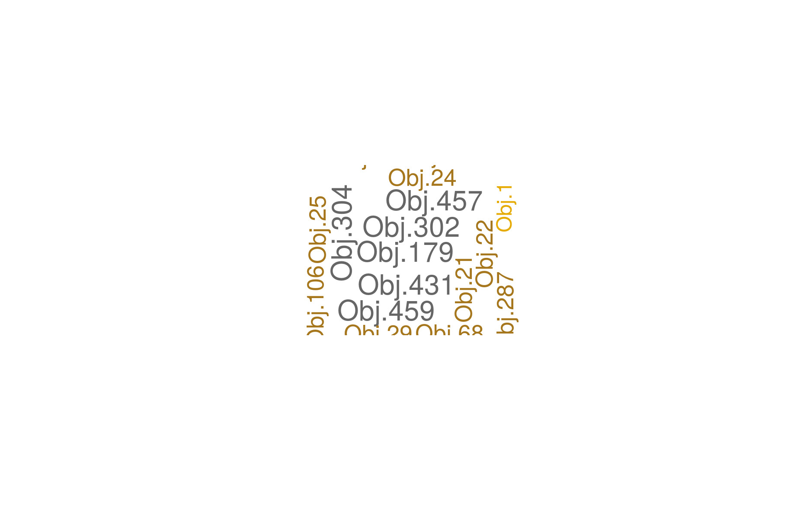

# Adapt Project

## Prerequisites
We have used R cran version 3.4.3 to write the scripts in the repository. 
It is necessary to install some packages before executing the scripts. They are detailed in *chek_packages.r*.
For example, to install a package from R, we do:

install.packages("RJSONIO",repos = "http://cran.us.r-project.org")

install.packages("jsonlite",repos = "http://cran.us.r-project.org")

install.packages("curl",repos = "http://cran.us.r-project.org")

install.packages("grid",repos = "http://cran.us.r-project.org")

install.packages("ggplot2",repos = "http://cran.us.r-project.org")

install.packages("gridBase",repos = "http://cran.us.r-project.org")

install.packages("gridExtra",repos = "http://cran.us.r-project.org")

install.packages("grid",repos = "http://cran.us.r-project.org")

install.packages("ggplot2",repos = "http://cran.us.r-project.org")

install.packages("lattice",repos = "http://cran.us.r-project.org")

install.packages("latticeExtra",repos = "http://cran.us.r-project.org")

install.packages("dplyr",repos = "http://cran.us.r-project.org")

install.packages("tidyr",repos = "http://cran.us.r-project.org")

install.packages("glue",repos = "http://cran.us.r-project.org")

install.packages("reshape2",repos = "http://cran.us.r-project.org")

install.packages("stringi",repos = "http://cran.us.r-project.org")

install.packages("stringr",repos = "http://cran.us.r-project.org")

install.packages("data.table",repos = "http://cran.us.r-project.org")

install.packages("RNeo4j",repos = "http://cran.us.r-project.org")

install.packages("RCurl",repos = "http://cran.us.r-project.org")

install.packages("plyr",repos = "http://cran.us.r-project.org")

...
 
It is preferable to install RStudio to manage the project and execute the scripts. Although, the use of shell scripts is also possible as detailed below.

 
## Running AR-RULES MINING: 
### Data Generation and Preparation:
It is the first step of the workflow. It starts by querying the Neo4J database using a json specification file, and generates the formal context files with two formats: csv, and rcf.
This step can be done, either by *calling get_query.r* from RStudio, or using the bash script *extractProcessEvent.sh*. The needed information are: an input json specification file that conains the Gremlin query, an output csv file, and an output rcf file.
It is available in https://github.com/GaloisInc/adapt/blob/fcadev/fca/AR_Miner/extractProcessEvent.sh

Example: 

*$> ./extractProcessEvent.sh*:
It will create the ProcessEvent context files: *'./contexts/ProcessEventSample.csv'* and *'./contexts/PrecessEventSample.rcf'*. One can use the pre-produced file for Cadet-Pandex DB: https://github.com/GaloisInc/adapt/blob/fcadev/fca/AR_Miner/contexts/Context_ProcessEvent.csv, https://github.com/GaloisInc/adapt/blob/fcadev/fca/AR_Miner/contexts/Context_ProcessEvent.rcf.

We can do the same process under un R environment:

*R prompt> source("get_auery.r")*

*R prompt> get_query("JsonSpecFile"","rcf_context_file","csv_file"")*

In this first step, many other sub-modules are also available:

*process_rcf_context.r*:  this function takes as input an RCF context and generates a csv context file.

Example:

*R prompt> source("process_rcf_context.r")*

*R prompt> process_rcf_context=function(c"rcf_context_file","csv_file"")*

*csv_to_rcf.r*:  this function takes as input a csv context file and generates an RCF context.  
*load_rcf.r*:  this function takes as input an RCF context and loads a data structure in memory.

*load_csv.r*: this function takes as input a csv context and loads a data structure in memory.

*check_packages.r*: checks the needed packages.

We have also implemented the *check_csv_contexts.sh* script, which does a comparison between a reference csv file (context) and a new procuced csv file. It allows us the early detection of any abnormal format of the input data.

Example: 

*$> ./check_csv_contexts.sh*

### Data Processing and scoring:

\$> ./context_scoring_From_CSV.sh: in https://github.com/GaloisInc/adapt/blob/fcadev/fca/AR_Miner/c./C  ontext_Scoring_From_CSV.sh.
It is the second main script that can be executed after *$> ./extractProcessEvent.sh*, since it takes a *context_name* as string, the previously produced *csv context*, and *rcf context files*, an *output_scoring_file* and numerical values for *MinSup* and *MinConf*.
An output example is in https://github.com/GaloisInc/adapt/blob/fcadev/fca/AR_Miner/contexts/Scoring_Of_Context_ProcessEvent-cadet-pandex.csv.
 
Default example to run is \$> *./Context_scoring_From_CSV.sh* :

*#!/bin/bash *

*context_name='ProcessEvent'*

*csv_file='./contexts/Context_ProcessEvent.csv'*

*rcf_file='./contexts/Context_ProcessEvent.rcf'*

*output_scoring_file='./contexts/Scoring_Of_Context_ProcessEvent.csv'*

*MinSup='97'*

*MinConf='97'*

*Rscript contexts_scoring_shell.r $context_name $csv_file $rcf_file $output_scoring_file $MinSup $MinConf*
 
 

### Data scoring with feedback analysis:
 
 \$>  *./Scoring_Rules_Using_Benign_Feedback_Shell.sh*: The aim with this analysis is to include the rules, which were generated with the benign DB as feedback during the scoring and ranking. It uses the previously generated scores file *Scoring_Of_Context_ProcessEvent.csv* that becomes the input of the feedback analysis as *original_scoring_file* in the shell script. It also needs a benign association rules that are generated using the same context in the benign DB (*benign_rules.csv* available for caet panedx in https://github.com/GaloisInc/adapt/blob/fcadev/fca/AR_Miner/contexts/AssociationRules_Benign_ProcessEvent-Cadet-Pandex.csv). 
 
Default example to run in \$> *./Scoring_Rules_Using_Benign_Feedback_Shell.sh* :

*#!/bin/bash*
*context_name='ProcessEvent'*
*csv_file='./contexts/Context_ProcessEvent.csv'*
*rcf_file='./contexts/Context_ProcessEvent.rcf'*
*output_scoring_file='./contexts/Output_Scoring_Feedback_Of_Context_ProcessEvent.csv'*
*MinSup='97'*
*MinConf='97'*
*Benign_file='./contexts/AssociationRules_Benign_ProcessEvent-Cadet-Pandex.csv'*
*original_scoring_file='./contexts/Scoring_Of_Context_ProcessEvent-cadet-pandex.csv'*
*Rscript Scoring_Rules_Using_Benign_feedback_Shell.r $context_name $csv_file $rcf_file $output_scoring_file $MinSup $MinConf $Benign_file $original_scoring_file*
 
 An output example of this script is in https://github.com/GaloisInc/adapt/blob/fcadev/fca/AR_Miner/contexts/Output_Scoring_Feedback_Of_Context_ProcessEvent.csv:

### Violator objects analysis:

\$>  *./Trajectory_Violator_Objects_Shell.sh*: This script analyses the variation of the positions of the violator objects in the ranked violator lists before and after the feedbacks have been taken into account. It takes as inputs: The scoring file produced with *./Context_scoring_From_CSV.sh*, the second scoring file produced with   *./Scoring_Rules_Using_Benign_Feedback_Shell.sh*, and the adequate ground truth file (eg. cadets_pandex_webshell.json).

### Data Visualisation:
 
*Rule_coloring.r* (under progress): generates an HTML file for coloring the rules, and a word cloud of the objects that violate rules, regarding their score.
 

