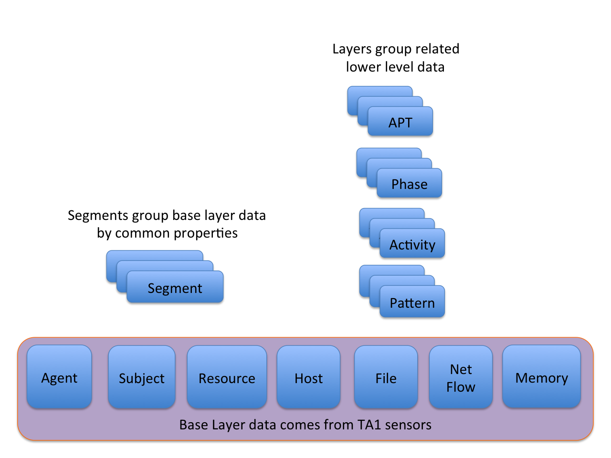
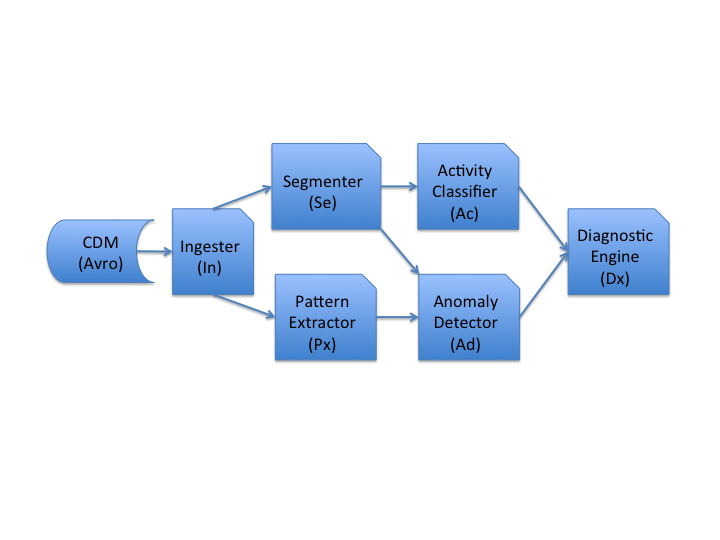
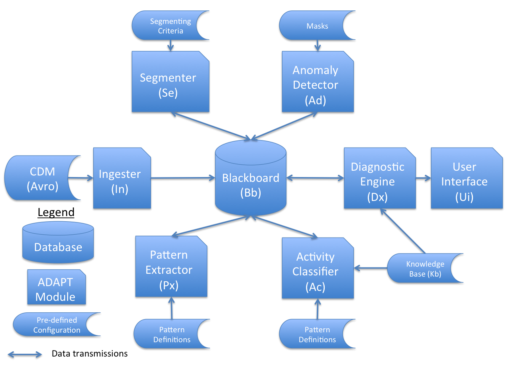

#ADAPT Phase 1 Architecture Specification (DRAFT)

*Distribution Statement D: Distribution Authorized to the Department of Defense and U.S. DoD contractors only*

Purpose of this Document
=======
This document specifies the architecture of the ADAPT system intended for first power-on in May, 2016 and first evaluation in September 2016. This specification includes:

* description of our first test case scheduled for mid-May 2016
* overall architecture and interconnectivity discussion
* type-based description of all modules in the system
* schema of the blackboard database shared by all modules
* semantics and syntax of all stored data used to configure modules in the system
* mapping from schema of TA-1 provided input data to blackboard schema

First Test Case
===========
(To be verified by David Burke with TA5 team)
Our first evaluation target will be the social media APT setting as described by TA4. A key aspect of that setting is a command and control APT phase that persists on the described Pandex server. One activity described for that C2 phase is the use of nginx to connect to a port, listen for a while, and then disconnect. Our first test case will emulate this activity using a simple script. Using at least SPADE (SRI TA1) data, but hopefully at least one other data source, we will test our ability to detect and classify this activity.

The platform setup we will use for first test is to integrate our VM-based ADAPT platform with the "TC-in-a-box" platform provided by TA3. All modules in our system will interact with data in the Blackboard (Bb) for this test case. Modules may subscribe to notification feeds provided by other modules that indicate when new data has arrived in Bb.

Relationship to TC Common Data Model
=========
The ADAPT architecture operates on data derived from inputs from TA1 performers and expressed in the TC Common Data Model (CDM). Our data, stored in our Blackboard database, maps directly to the CDM as shown in the Blackboard schema section of this specification. At present, this document is current with CDM v0.7.

Architecture of ADAPT
========
Overview of Abstraction layers in ADAPT
--------
System activity data used and created by an ADAPT instance is graph-structured and hierarchical. The figure below
shows the abstraction layers we use in ADAPT.



Data imported from TA-1 sensors comprises the *base layer* of our database. This layer models

* units of execution in the system at various abstractions from individual events to processes
* artifacts such as files, network flows, and memory buffers
* agents such as humans (primarily for attribution purposes)
* hosts on which units of execution run and artifacts reside
* relationships among these entity classes

Because the volume of base layer data will be large, ADAPT abstracts this data to allow reasoning at lower bandwidth. We use a multi-layer hierarchical abstraction as well as a single-layer proximity abstraction.

Our hierarchical abstraction begins with the pattern layer. Pattern instances are intuitive collections of base layer data. For example, an instance of the pattern *PROCESS Reads FILE* might be comprised of a unit of execution (the process), an artifact (the file), and an event (the read), along with the relationship instances that connect these entity instances. Each pattern instance is represented in our data model as a pattern node, along with edges connecting that node to each of the base layer entity instances that comprise its pattern. By inference, edges connecting those base layer entities are included in the pattern as well.

The next layer of abstraction is the activity layer. Activities are the leaf entities in our APT grammar, and also represent intuitive computations. Activities are comprised of patterns. For example, an instance of the activity *Copy File to Directory* might be comprised of several pattern instances: {*PROCESS Opens FILE*, *PROCESS Reads FILE*, *PROCESS Opens File for Write*, *PROCESS Writes File*, and *PROCESS Closes File*}. Each activity instance is represented in our data model as an activity node along with edges connecting that node to each of the pattern instances that comprise that activity. By inference, edges connecting those pattern instances are included in the activity as well.

The next layer of abstraction is the APT Phase layer. Phases are the node entities in our APT grammar tree, and represent instances of APT phases as described there. Phases are comprised of activities. Each phase instance is represented in our data model as a phase node along with edges connecting that node to each of the activity instances that comprise the phase. As above, edges connecting those components are included implicitly.

The next layer of abstraction is the APT layer. APTs are the root of our APT grammar, and represent instances of entire APTs. Each APT instance is comprised of phase instances. APTs are represented by an APT node along with edges from that node to the Phases that comprise the APT instance.

Overview of Segmentation in ADAPT
--------
Orthogonal to the hierarchical structure above is the notion of segmentation. An ADAPT base layer graph can be segmented into smaller graphs for ease of reasoning and computation. Segmentation involves grouping all such data by common characteristics. Such characteristics are typically values of properties attached to some or all nodes. For example, an ADAPT graph might be segmented by 2-hour time windows, resulting in a number of sub-graphs corresponding to 2-hour windows. As another example, an ADAPT graph might be segmented by process ID, resulting in a distinct sub-graph related to each unique process ID reported in the data. Segmentation can be accomplished using combinations of characteristics as well. For example, an ADAPT graph might be segmented into a unique subgraph for each process ID in each 2-hour window. Segments are represented by a Segment node along with edges from that node to all nodes that belong to the segment.

ADAPT Architecture
-------
A simplified data flow diagram of ADAPT may help explain how analysis is performed. The figure below shows a
conceptual view of how data flows through the ADAPT system. Base layer data consisting of Subjects, Objects, Events,
and relationships comes from TA-1 sensors and is transformed into
our internal model by the Ingester. The Segmenter groups base layer data by common properties, for example,
process ID. The Anomaly Detector observes features of base layer data on a per-segment basis to
identify outliers of various kinds and score them by how unusual they are.
The Pattern Extractor groups base layer data into intuitive primitive actions that we
call patterns, for example,
"Process Reads File". The Activity classifier groups such
patterns into higher-level behaviors, for example, "Copying file to new directory". The Diagnostic Engine
groups activities into candidate APT phases and those phases into candidate APTs, and scores each candidate
using the anomaly scores from the Anomaly Detector. Prioritized candidates are presented to human operators for
analysis.



The architecture of ADAPT is shown below. Note that data flow from the diagram above is achieved by all modules communication via a common "blackboard" database.




Data flow at a high level works like this:

* The Ingester (In) takes as input data in the TA3-defined CDM Avro schema, pulling it from a Kafka queue topic provided by TA3. In produces as output base layer data in the blackboard (Bb) that conforms to the Bb schema described later
* The Pattern Extractor (Px) uses a pre-defined set of patterns. Px takes as input data from Bb, one segment at a time (the entire graph is the default segment), and produces as output new data in Bb at the pattern layer of abstraction.
* The Segmenter (Se) uses a pre-defined set of segmentation criteria. It takes as input base layer data from Bb and produces as output new data in Bb at the Segment layer of abstraction described later.
* The anomaly detector (Ad) uses a pre-defined set of masks that define the features to be analyzed for anomalies. Ad takes as input data from Bb, one segment at a time, and produces as output anomaly score annotations for each segment surveyed
* The activity classifier (Ac) uses a pre-defined set of activities that are exactly the leaves in our APT grammar tree. Ac takes as input data from Bb at the pattern layer of abstraction, and produces as output new data in Bb at the activity layer of abstraction
* The Diagnostic Engine (Dx) uses the pre-defined APT grammar from Kb. Dx takes as input data from Bb at the activity layer of abstraction, along with anomaly scores attached to segments, and produces as output new data in Bb at the diagnosis layer of abstraction. Dx also communicates discovered APT candidates to the Ui for display to the user.

For our Phase 1 ADAPT System (Alpha-1), we consider only non-iterative analysis by ADAPT modules. That is, each module operates on Bb data only once. Later on, we may employ iterative processing both to accommodate streaming input data and to allow for more powerful analytics.

Analysis done by ADAPT follows the data flow described above. For Phase 1, only forensic analysis is supported, so no incremental passes are required to assimilate additional base layer data.

Describing ADAPT Modules
---------
The following sections describe each ADAPT module. Each section should cover the following, but need be no
longer than a page:

* A detailed type signature for the module's inputs and outputs, suitable for other modules to interact with the module
* A description of any private stored data, such as templates or knowledge, that the module will use
* A description at your choice of detail of how you do the processing you do
* Any limitations you see to your planned implementation that might affect our first testing
* How many concurrent instances of your module will be running at a time, and how they distinguish data on which they operate
* What dependencies you have on other modules

The Ingester (In) - Tom
------------
`In:: [CDM-Element] > [[base-node], [base-edge]]`

That is, the In takes in a set of CDM statements and produces a graph of nodes and edges in the Bb. The base node
and base edge graph
components produced are subsets of the Bb schema described later in this specification.

The Pattern Extractor (Px) - Erin/Trevor
--------
`Px:: [[base-node],[base-edge]]> [Pattern-definition] > [[pattern-node,[pattern-to-base-edge]]]``

That is, Px takes in the graph in the Bb and a list of pattern definitions, and produces as output pattern nodes in the Bb and associated edges connecting those nodes to their respective base layer component nodes

The Segmenter (Se) - Adria
---------
`Se:: [[base-node],[base-edge],[pattern-node],[pattern-to-base-edge]] > [segment-criterion] > [<segment-node,[segment-to-base-edge]>]`

That is, the Se takes in a graph of nodes and edges in the Bb and a list of segmentation criteria, and produces in the Bb a set of segment nodes and the edges that connect each to the other nodes in the graph that are its members.

The Anomaly Detector (Ad) - Alan
-------
`Ad:: [[segment-node],[segment-edge]] > [Mask] > segment-identifier > [<segment-node-id,anomaly-type,anomaly-score>]`

That is, Ad takes in the graph in the Bb, a list of masks, and a segment identifier, and produces as
output a list of anomaly score annotations attached to segment nodes in the graph.

The Activity Classifier (Ac) - Hoda
----------
`Ac:: [segment-node] > [segment-identifier] > [<activity-node,[activity-to-segment-edge]>]`

That is, Ac takes in the graph in the Bb and a segment identifier, and produces as output a list of activity nodes in the Bb and the edges that connect them to their component segment nodes.
An input set of base nodes is included by reference via the segment identifier.

Unlike Dx, for example, Ac is a streaming component, making purely local decisions.
It allocates a bounded amount of memory,
queries Bb only for nodes within the segment,
and has processing time proportional to segment size.

The Diagnostic Engine (Dx) - Rui
--------
`DX:: [[<Z-node, [<anomaly-label anomaly-score>)], [<activity-label, activity-score>]>],[Z-edge]],  APT-grammar > [<Z-APT-node,[Z-APT-to-phase-edge]>]`

DX expects *one DAG* where each node is of type `Z`, where `Z` is a class instance of one of the following: Segment, Pattern.

That is, Dx takes in the graph in the Bb and produces as output a list of phase nodes in the Bb and the edges that connect them to their component activities, and a list of APT nodes and the edges that connect them to their component phases.

The Blackboard (Bb) - Erin
----------
`Bb:: Query > [[node],[edge]]`

The Knowledge Base (Kb) - David
-----------
The Kb has no type signature that I can think of.

Blackboard Schema for ADAPT
=======
In this section, we describe the conceptual model we use internally to Bb is shown below, along with the mapping from the TC Common Data Model to our internal model.


Each instance of an entity or relationship class may have certain required as well as other optional attributes that describe that instance. Details of entities, relationships, and attributes in the model are defined in the Entities and Relationships sections below.

Data Types for ADAPT Schema
===========
The following are type definitions for types used in the schema description.

*prov-tc:source* is used in many places, and maps to CDM enum type InstrumentationSource:

```
    enum InstrumentationSource {
        SOURCE_LINUX_AUDIT_TRACE,
        SOURCE_LINUX_PROC_TRACE,
        SOURCE_LINUX_BEEP_TRACE,
        SOURCE_FREEBSD_OPENBSM_TRACE,
        SOURCE_ANDROID_JAVA_CLEARSCOPE,
        SOURCE_ANDROID_NATIVE_CLEARSCOPE,
        SOURCE_LINUX_AUDIT_CADETS,
        SOURCE_WINDOWS_DIFT_FAROS
    }
```

and maps to the Titan data type:
[schema]: #
makePropertyKey('source').dataType(Short.class).cardinality(Cardinality.SINGLE)

*prov-tc:agentType* is used in Agents, and maps to CDM enum type PrincipalType:

```
enum PrincipalType {
        PRINCIPAL_LOCAL,            // a principal local on the host
        PRINCIPAL_REMOTE            // a remote principal
    }
```

and maps to the Titan data type:
[schema]: #
makePropertyKey('agentType').dataType(Short.class).cardinality(Cardinality.SINGLE)

*prov-tc:eventType* is used in Subjects, and maps to CDM enum type EventType:

```
    enum EventType {
        EVENT_ACCEPT,
        EVENT_BIND,
        EVENT_CHANGE_PRINCIPAL,
        EVENT_CHECK_FILE_ATTRIBUTES,
        EVENT_CLONE,
        EVENT_CLOSE,
        EVENT_CONNECT,
        EVENT_CREATE_OBJECT,
        EVENT_CREATE_THREAD,
        EVENT_EXECUTE,
        EVENT_FORK,
        EVENT_LINK,
        EVENT_UNLINK,
        EVENT_MMAP,
        EVENT_MODIFY_FILE_ATTRIBUTES,
        EVENT_MPROTECT,
        EVENT_OPEN,
        EVENT_READ,
        EVENT_RENAME,
        EVENT_WRITE,
        EVENT_SIGNAL,
        EVENT_TRUNCATE,
        EVENT_WAIT,
        EVENT_BLIND
        EVENT_UNIT,
        EVENT_UPDATE
    }
```

and maps to the Titan data type:
[schema]: #
makePropertyKey('eventType').dataType(Short.class).cardinality(Cardinality.SINGLE)

*prov-tc:sourceType* is used in Resources, and maps to CDM enum SourceType:

```
enum SourceType {
        // base sensors
        SOURCE_ACCELEROMETER,
        SOURCE_TEMPERATURE,
        SOURCE_GYROSCOPE,
        SOURCE_MAGNETIC_FIELD,
        SOURCE_HEART_RATE,
        SOURCE_LIGHT,
        SOURCE_PROXIMITY,
        SOURCE_PRESSURE,
        SOURCE_RELATIVE_HUMIDITY,
        // composite sensors
        SOURCE_LINEAR_ACCELERATION,
        SOURCE_MOTION,
        SOURCE_STEP_DETECTOR,
        SOURCE_STEP_COUNTER,
        SOURCE_TILT_DETECTOR,
        SOURCE_ROTATION_VECTOR,
        SOURCE_GRAVITY,
        SOURCE_GEOMAGNETIC_ROTATION_VECTOR,
        // camera and GPS, temporary
        SOURCE_CAMERA,
        SOURCE_GPS
    }
```

and maps to the Titan data type:
[schema]: #
makePropertyKey('srcSinkType').dataType(Short.class).cardinality(Cardinality.SINGLE)

*prov-tc:trustworthiness* is used in many places, and maps to CDM enum type IntegrityTag:

```
  enum IntegrityTag {
        INTEGRITY_UNTRUSTED,
        INTEGRITY_BENIGN,
        INTEGRITY_INVULNERABLE
    }
```

and maps to the Titan data type:
[schema]: #
makePropertyKey('trustworthiness').dataType(Short.class).cardinality(Cardinality.SINGLE)

*prov-tc:privacyLevel* is used in many places, and maps to CDM enum type ConfidentialityTag

```
 enum ConfidentialityTag {
        CONFIDENTIALITY_SECRET,
        CONFIDENTIALITY_SENSITIVE,
        CONFIDENTIALITY_PRIVATE,
        CONFIDENTIALITY_PUBLIC
    }
```

and maps to the Titan data type:
[schema]: #
makePropertyKey('prov-tc:privacyLevel').dataType(Short.class).cardinality(Cardinality.SINGLE)

*prov-tc:subjectType* is used in Subjects, and maps to CDM type SubjectType, but adds two additional enum values:

```
    enum SubjectType {
        SUBJECT_PROCESS,
        SUBJECT_THREAD,
        SUBJECT_UNIT,
        SUBJECT_BLOCK,
        SUBJECT_EVENT
    }
```

and maps to the Titan data type:
[schema]: #
makePropertyKey('subjectType').dataType(Short.class).cardinality(Cardinality.SINGLE)

*prov-tc:strength* is used in wasDerivedFrom relationships:

```
	enum Strength {
		WEAK,
		MEDIUM,
		STRONG
	}
```

and maps to the Titan data type:
[schema]: #
makePropertyKey('prov-tc:strength').dataType(Short.class).cardinality(Cardinality.SINGLE)

*prov-tc:derivation* is used in wasDerivedFrom relationships:

```
	enum Derivation {
		COPY,
		ENCODE,
		COMPILE,
		ENCRYPT,
		OTHER
	}
```

and maps to the Titan data type:
[schema]: #
makePropertyKey('prov-tc:derivation').dataType(Short.class).cardinality(Cardinality.SINGLE)

*prov-tc:argValue* is a byte array used in Subjects and maps to the Titan data type:
[schema]: #
makePropertyKey('prov-tc:argValue').dataType(Byte.class).cardinality(Cardinality.LIST)

Other primitive types used in our model:

* *prov-tc:properties* : map\<string,string\>;
  and maps to the Titan data type:
  [schema]: #
  makePropertyKey('properties').dataType(String.class).cardinality(Cardinality.LIST)

* *prov-tc:uid* : string;
  and maps to the Titan data type:
  [schema]: #
  makePropertyKey('ident').dataType(String.class).cardinality(Cardinality.SINGLE)

* *prov-tc:url* : string;
  and maps to the Titan data type:
  [schema]: #
  makePropertyKey('url').dataType(String.class).cardinality(Cardinality.SINGLE)

* *prov-tc:file-version* : int;
  and maps to the Titan data type:
  [schema]: #
  makePropertyKey('file-version').dataType(Integer.class).cardinality(Cardinality.SINGLE)

* *prov-tc:size* : int;
  and maps to the Titan data type:
  [schema]: #
  makePropertyKey('size').dataType(Integer.class).cardinality(Cardinality.SINGLE)

* *prov-tc:permissions* : short;
  and maps to the Titan data type:
  [schema]: #
  makePropertyKey('permissions').dataType(Short.class).cardinality(Cardinality.SINGLE)

* *prov-tc:time* : ZuluTime;
  and maps to the Titan data type:
  [schema]: #
  makePropertyKey('time').dataType(Long.class).cardinality(Cardinality.SINGLE)

* *prov:startedAtTime* : ZuluTime;
  and maps to the Titan data type:
  [schema]: #
  makePropertyKey('startedAtTime').dataType(Long.class).cardinality(Cardinality.SINGLE)

* *prov:endedAtTime* : ZuluTime;
  and maps to the Titan data type:
  [schema]: #
  makePropertyKey('endedAtTime').dataType(Long.class).cardinality(Cardinality.SINGLE)

* *prov-tc:srcAddress* : string;
  and maps to the Titan data type:
  [schema]: #
  makePropertyKey('srcAddress').dataType(String.class).cardinality(Cardinality.SINGLE)

* *prov-tc:srcPort* : int;
  and maps to the Titan data type:
  [schema]: #
  makePropertyKey('srcPort').dataType(Integer.class).cardinality(Cardinality.SINGLE)

* *prov-tc:dstAddress* : string;
  and maps to the Titan data type:
  [schema]: #
  makePropertyKey('dstAddress').dataType(String.class).cardinality(Cardinality.SINGLE)

* *prov-tc:dstPort* : int;
  and maps to the Titan data type:
  [schema]: #
  makePropertyKey('dstPort').dataType(Integer.class).cardinality(Cardinality.SINGLE)

* *prov-tc:IpProtocol* : int;
  and maps to the Titan data type:
  [schema]: #
  makePropertyKey('ipProtocol').dataType(Integer.class).cardinality(Cardinality.SINGLE)

* *prov-tc:pageNumber* : Maybe int;
  and maps to the Titan data type:
  [schema]: #
  makePropertyKey('pageNumber').dataType(Integer.class).cardinality(Cardinality.SINGLE)

* *prov-tc:address* : long;
  and maps to the Titan data type:
  [schema]: #
  makePropertyKey('address').dataType(Long.class).cardinality(Cardinality.SINGLE)

* *prov-tc:pid* : int;
  and maps to the Titan data type:
  [schema]: #
  makePropertyKey('pid').dataType(Integer.class).cardinality(Cardinality.SINGLE)

* *prov-tc:ppid* : int;
  and maps to the Titan data type:
  [schema]: #
  makePropertyKey('ppid').dataType(Integer.class).cardinality(Cardinality.SINGLE)

* *prov-tc:unitid* : int;
  and maps to the Titan data type:
  [schema]: #
  makePropertyKey('unitid').dataType(Integer.class).cardinality(Cardinality.SINGLE)

* *prov-tc:commandLine* : string;
  and maps to the Titan data type:
  [schema]: #
  makePropertyKey('commandLine').dataType(String.class).cardinality(Cardinality.SINGLE)

* *prov-tc:importLibs* : list\<string\>;
  and maps to the Titan data type:
  [schema]: #
  makePropertyKey('importLibs').dataType(String.class).cardinality(Cardinality.SET)

* *prov-tc:exportLibs* : list\<string\>;
  and maps to the Titan data type:
  [schema]: #
  makePropertyKey('exportLibs').dataType(String.class).cardinality(Cardinality.SET)

* *prov-tc:env* : map\<string,string\>;
  and maps to the Titan data type:
  [schema]: #
  makePropertyKey('env').dataType(String.class).cardinality(Cardinality.LIST)

* *prov-tc:pInfo* : string;
  and maps to the Titan data type:
  [schema]: #
  makePropertyKey('pInfo').dataType(String.class).cardinality(Cardinality.SINGLE)

* *prov-tc:location* : int;
  and maps to the Titan data type:
  [schema]: #
  makePropertyKey('location').dataType(Integer.class).cardinality(Cardinality.SINGLE)

* *prov-tc:ppt* : string;
  and maps to the Titan data type:
  [schema]: #
  makePropertyKey('ppt').dataType(String.class).cardinality(Cardinality.SINGLE)

* *prov-tc:args* : list\<prov-tc:argValue\>;
  and maps to the Titan data type:
  [schema]: #
  makePropertyKey('args').dataType(Byte.class).cardinality(Cardinality.LIST)

* *prov-tc:gid* : list\<int\>;
  and maps to the Titan data type:
  [schema]: #
  makePropertyKey('gid').dataType(String.class).cardinality(Cardinality.LIST)

* *prov-tc:userID* : int;
  and maps to the Titan data type:
  [schema]: #
  makePropertyKey('userID').dataType(String.class).cardinality(Cardinality.SINGLE)

* *prov-tc:sequence* : long;
  and maps to the Titan data type:
  [schema]: #
  makePropertyKey('sequence').dataType(Long.class).cardinality(Cardinality.SINGLE)


Data Model Classes
=========
ADAPT defines the following classes. In each case, we specify all currently recognized attributes. No alternates to the attributes shown are allowed. That is, the shown attributes are the only option available to represent the semantics they represent.

Entities (Objects in CDM)
------
An entity may be created, referenced, used, or destroyed, but does not take action on its own. Entity sub-types recognized at present in the TC domain include files, network packets, and memory locations. More may be added later. Shown below are the attributes of the entity class.

[schema]: #
makeVertexLabel('Entity')

Entity-File (File Object in CDM)
------
[schema]: #
makeVertexLabel('Entity-File')

Required:

* a unique identifier for the file entity instance (*prov-tc:uid*) // maps to CDM FileObject.uid
* the URL used in the target system for the file (*prov-tc:url*) // maps to CDM FileObject.url

Desired:

* size in bytes of the file (*prov-tc:size*) // maps to CDM FileObject.size
* the version number of the file (*prov-tc:file-version*) // maps to CDM FileObjerct.version
* access permissions (*prov-tc:permissions*) // maps to CDM FileObject.permission
* creation time (*prov-tc:time*) // maps to CDM FileObject.lastTimestampMicros

Nice to have:

* name of TA1 sensor source of the information provided (*prov-tc:source*) // maps to CDM FileObject.source
* trustworthiness of the file (*prov-tc:trustworthiness*) // maps to CDM FileObject.integrity
* sensitivity of the file (*prov-tc:privacyLevel*) // maps to CDM FileObject.confidentiality
* other properties (*prov-tc:properties*) // maps to CDM FileObject.properties

Entity-NetFlow (NetFlow Object in CDM)
--------
[schema]: #
makeVertexLabel('Entity-NetFlow')

Required:

* a unique identifier for the network flow (*prov-tc:uid*) // maps to CDM NetFlowObject.uid
* the source IP address of the network flow (*prov-tc:srcAddress*) // maps to CDM NetFlowObject.srcAddress
* the source port of the network flow (*prov-tc:srcPort*) // maps to CDM NetFlowObject.srcPort
* the destination IP address of the network flow (*prov-tc:dstAddress*) // maps to CDM NetFlowObject.dstAddress
* the destination port of the network flow (*prov-tc:dstPort*) // maps to CDM NetFlowObject.dstPort
* number of bytes sent
* number of bytes received

Desired:

* port modified time (*prov-tc:time*) // maps to CDM NetFlowObject.lastTimestampMicros
* access permissions (*prov-tc:permissions*) // maps to CDM NetFlowObject.permission

Nice to have:

* name of TA1 sensor source of the information provided (*prov-tc:source*) // maps to CDM NetFlowObject.source
* trustworthiness of the flow (*prov-tc:trustworthiness*) // maps to CDM NetFlowObject.integrity
* sensitivity of the flow (*prov-tc:privacyLevel*) // maps to CDM NetFlowObject.confidentiality
* other properties (*prov-tc:properties*) // maps to CDM NetFlowObject.properties


Entity-Memory (Memory Object in CDM)
---------
[schema]: #
makeVertexLabel('Entity-Memory')

Required:

* a unique identifier for the memory area (*prov-tc:uid*) // maps to CDM MemoryObject.uid
* the virtual page number of the area (*prov-tc:pageNumber*) // maps to CDM MemoryObject.pageNumber
* the referenced virtual address (*prov-tc:address*) // maps to CDM MemoryObject.memoryAddress

Desired:

* access permissions (*prov-tc:permissions*) // maps to CDM MemoryObject.permission
* modification time (*prov-tc:time*) // maps to CDM MemoryObject.lastTimestampMicros

Nice to have:

* name of TA1 sensor source of the information provided (*prov-tc:source*) // maps to CDM MemoryObject.source
* trustworthiness of the memory (*prov-tc:trustworthiness*) // maps to CDM MemoryObject.integrity
* sensitivity of the memory (*prov-tc:privacyLevel*) // maps to CDM MemoryObject.confidentiality
* other properties (*prov-tc:properties*) // maps to CDM MemoryObject.properties


Resource (SourceObject in CDM)
-------
A resource is a physical device that can generally be read, but not written, such as a GPS sensor or camera.

[schema]: #
makeVertexLabel('Resource')

Required:

* a unique identifier for the resource (*prov-tc:uid*) // maps to CDM SourceObject.uid
* the type of the resource (*prov-tc:sourceType*) // maps to CDM SourceObject.type

Desired:

* last used time (*prov-tc:time*) // maps to CDM SourceObject.lastTimestampMicros
* access permissions (*prov-tc:permissions*) // maps to CDM SourceObject.permission

Nice to have:

* trustworthiness (*prov-tc:trustworthiness*) // maps to CDM SourceObject.integrity
* sensitivity (*prov-tc:privacyLevel*) // maps to CDM SourceObject.confidentiality
* other properties (*prov-tc:properties*) // maps to CDM ResourceObject.properties


Subject (Subject in CDM)
------------------
A subject represents activity by a thread of running computation. It may be started by another subject, and may take action on its own to start other subjects or to affect entities. We would normally call this class "activity" per W3CPROV, but activity is used elsewhere in our schema, so we adopt the CDM name instead. Subjects in our model include Events in CDM as well as Subjects in CDM

[schema]: #
makeVertexLabel('Subject')

Required:

* a unique identifier for the subject (*prov-tc:uid*) // maps to CDM Subject.uid, Event.uid
* a type for the subject (*prov-tc:subjectType*) // maps to CDM Subject.type
* an event description if the type above is Event (*prov-tc:eventType*) // maps to CDM Event.type
* a process ID (*prov-tc:pid*) // maps to CDM Subject.pid
* a process ID of its parent (*prov-tc:ppid*) // maps to CDM Subject.ppid
* a unique identifier of a unit (outer handler loop instance) (*prov-tc:unitid*) // maps to CDM Subject.unitId
* a list of event parameter values (*prov-tc:args*) // maps to CDM Event.parameters
* a sequence number for events all generated by the same subject one level up in a hierarchy (*prov-tc:sequence*) // maps to CDM Event.sequence

Desired:

* a start time or event occurrence time (*prov:startedAtTime*) // maps to CDM Subject.startTimestampMicros, Event.startTimeMicros
* the command line currently executing (*prov-tc:commandLine*) // maps to CDM Subject.cmdLine
* a list of imported libraries used by the Subject (*prov-tc:importLibs*) // maps to CDM Subject.importedLibraries
* a list of exported libraries offered by the Subject (*prov-tc:exportLibs*) // maps to CDM Subject.exportedLibraries
* the program point where an Event was initiated (*prov-tc:ppt*) // maps to CDM Event.programPoint
* an end time (*prov:endedAtTime*) // maps to CDM Subject.endTimestampMicros

Nice to have:

* name of TA1 sensor source of the information provided (*prov-tc:source*) // maps to CDM Subject.source, Event.sourece
* a string of additional process information (*prov-tc:pInfo*) // maps to CDM Subject.pInfo
* a location in an associated Entity used in an Event (*prov-tc:location*) // maps to CDM Event.location
* additional properties of the Subject (*prov-tc:properties*) // maps to CDM Subject.properties, Event.properties
* the size of the data affecting an Event (*prov-tc:size*) // maps to CDM Event.size
* a list of environment variables (*prov-tc:env*) // not in CDM

Host (Host in CDM)
--------
A system that may host activities and entities. For now, we ignore the obvious question about hierarchies of hosts, for example, VMs running on hardware.

[schema]: #
makeVertexLabel('Host')

Required:

* a unique identifier for the host (*prov-tc:uid*). Unsigned 32b integer

Desired:

* an IP address for the host (*prov-tc:ipAddress*). Unsigned 32b integer

Nice to have:

* name of TA1 sensor source of the information provided (*prov-tc:source*). 32B String

Agent (Principal in CDM)
-----
An agent represents an actor that is not a Subject on a monitored machine. An agent may be human, may be a machine in the target network that has no monitoring, or may be a machine outside the monitored network. Agents have no required attributes.

[schema]: #
makeVertexLabel('Agent')

Required:

* a unique identifier for the agent (*prov-tc:uid*) // maps to CDM Principal.uid

Desired:

* a user ID (*prov-tc:userId*) // maps to CDM Principal.userId
* a list of group identifiers (*prov-tc:gid*) // maps to CDM Principal.groupIds
* the type of agent (*prov-tc:agentType*) // maps to CDM Principal.type

Nice to have:

* name of TA1 sensor source of the information provided (*prov-tc:source*) // maps to CDM Principal.InstrumentationSource
* additional properties of the Subject (*prov-tc:properties*) // maps to CDM Principal.properties


Pattern (not in CDM)
-----
A pattern is a structure comprised of base layer elements such as Subject or Entity, and might also include Agents.

[schema]: #
makeVertexLabel('Pattern')

Required:

* A pattern template identifier that the pattern instance matches (*prov-tc:patternID*). Unsigned 16b integer.

Activity (not in CDM)
-------
An activity is a structure comprised of pattern instances. Activities strictly correspond to leaves in our APT grammar. Required:

[schema]: #
makeVertexLabel('Activity')

* An activity template identifier (that is, the name of a grammar leaf) that the activity instance matches (*prov-tc:activityID*). Unsigned 16b integer.

Phase (not in CDM)
-----
A phase is a structure comprised of activity instances. Phases strictly correspond to internal nodes in our APT grammar. Required:

[schema]: #
makeVertexLabel('Phase')

* A Phase identifier (that is, the ID of an APT Phase that this Phase instance stands for) (*prov-tc:phaseID*). 16b integer

APT (not in CDM)
----
An APT is a structure comprised of Phase instances. Required:

[schema]: #
makeVertexLabel('APT')

* A descriptive string for the APT candidate. 64B string


Segment (not in CDM)
-----
A Segment is a subgraph of the overall provenance graph. A segment may incorporate base layer structures, pattern instances,  activity instances, or phase instances. Required:

[schema]: #
makeVertexLabel('Segment')

* The segmentation criteria used. String
* A list of counts for each pattern type known to the system that are included in this segment. [unsigned 32b integer]
* An anomaly score. [Float]

Relationships
=============

Relationships in the ADAPT model are a super-set of elements of the CDM enum
type EdgeType. The enumeration and each edge type description is reproduced from
CDM below.  Other relationships are not present in CDM, because we add them as
results of our analysis.

CDM event edges will be inserted into Titan as two edges and one vertex:
    --typeOut-->typeVertex--typeIn-->
This is so event relationships can be annotated as part of a segment.

Non-event edges will be inserted into Titan as a single edge as they do not have
segment association.

EDGE_EVENT_AFFECTS_MEMORY, _FILE, _NETFLOW
-------

Previously a wasGeneratedBy relationship, indicates that an entity (the object
of the relationship) was impacted by a Subject. The subject of the relationship,
which must be of type Event, the type of which will reveal the exact impact
(creation, deletion, etc). No attributes.

[schema]: #
makeEdgeLabel('EDGE_EVENT_AFFECTS_MEMORY out').multiplicity(SIMPLE)
[schema]: #
makeVertexLabel('EDGE_EVENT_AFFECTS_MEMORY')
[schema]: #
makeEdgeLabel('EDGE_EVENT_AFFECTS_MEMORY in').multiplicity(SIMPLE)

EDGE_EVENT_AFFECTS_FILE
-------

And for files...

[schema]: #
makeEdgeLabel('EDGE_EVENT_AFFECTS_FILE out').multiplicity(SIMPLE)
[schema]: #
makeVertexLabel('EDGE_EVENT_AFFECTS_FILE')
[schema]: #
makeEdgeLabel('EDGE_EVENT_AFFECTS_FILE in').multiplicity(SIMPLE)

EDGE_EVENT_AFFECTS_NETFLOW
-------

And for netflows...

[schema]: #
makeEdgeLabel('EDGE_EVENT_AFFECTS_NETFLOW out').multiplicity(SIMPLE)
[schema]: #
makeVertexLabel('EDGE_EVENT_AFFECTS_NETFLOW')
[schema]: #
makeEdgeLabel('EDGE_EVENT_AFFECTS_NETFLOW in').multiplicity(SIMPLE)

EDGE_EVENT_AFFECTS_SUBJECT
-------

An event affects a subject (such as forking a process).

[schema]: #
makeEdgeLabel('EDGE_EVENT_AFFECTS_SUBJECT out').multiplicity(SIMPLE)
[schema]: #
makeVertexLabel('EDGE_EVENT_AFFECTS_SUBJECT')
[schema]: #
makeEdgeLabel('EDGE_EVENT_AFFECTS_SUBJECT in').multiplicity(SIMPLE)

EDGE_EVENT_AFFECTS_SRCSINK
-------

An event affects a generic src/sink object.

[schema]: #
makeEdgeLabel('EDGE_EVENT_AFFECTS_SRCSINK out').multiplicity(SIMPLE)
[schema]: #
makeVertexLabel('EDGE_EVENT_AFFECTS_SRCSINK')
[schema]: #
makeEdgeLabel('EDGE_EVENT_AFFECTS_SRCSINK in').multiplicity(SIMPLE)

EDGE_EVENT_HASPARENT_EVENT
-------

A metaevent that represents a set of child atomic events.

[schema]: #
makeEdgeLabel('EDGE_EVENT_HASPARENT_EVENT out').multiplicity(MANY2ONE)
[schema]: #
makeVertexLabel('EDGE_EVENT_HASPARENT_EVENT')
[schema]: #
makeEdgeLabel('EDGE_EVENT_HASPARENT_EVENT in').multiplicity(SIMPLE)

EDGE_EVENT_ISGENERATEDBY_SUBJECT
-------

An event is generated by a subject (every event is).

[schema]: #
makeEdgeLabel('EDGE_EVENT_ISGENERATEDBY_SUBJECT out').multiplicity(MANY2ONE)
[schema]: #
makeVertexLabel('EDGE_EVENT_ISGENERATEDBY_SUBJECT')
[schema]: #
makeEdgeLabel('EDGE_EVENT_ISGENERATEDBY_SUBJECT in').multiplicity(MANY2ONE)

EDGE_EVENT_CAUSES_EVENT
-------

Event causality tracking.

[schema]: #
makeEdgeLabel('EDGE_EVENT_CAUSES_EVENT out').multiplicity(MANY2ONE)
[schema]: #
makeVertexLabel('EDGE_EVENT_CAUSES_EVENT')
[schema]: #
makeEdgeLabel('EDGE_EVENT_CAUSES_EVENT in').multiplicity(SIMPLE)

EDGE_SUBJECT_AFFECTS_EVENT
-------

A subject affects an event (such as when killing a process).

[schema]: #
makeEdgeLabel('EDGE_SUBJECT_AFFECTS_EVENT out').multiplicity(SIMPLE)
[schema]: #
makeVertexLabel('EDGE_SUBJECT_AFFECTS_EVENT')
[schema]: #
makeEdgeLabel('EDGE_SUBJECT_AFFECTS_EVENT in').multiplicity(SIMPLE)

EDGE_SUBJECT_HASPARENT_SUBJECT
-------

A subject has a parent subject (such as thread has parent process).

[schema]: #
makeEdgeLabel('EDGE_SUBJECT_HASPARENT_SUBJECT out').multiplicity(MULTI)
[schema]: #
makeVertexLabel('EDGE_SUBJECT_HASPARENT_SUBJECT')
[schema]: #
makeEdgeLabel('EDGE_SUBJECT_HASPARENT_SUBJECT in').multiplicity(SIMPLE)

EDGE_SUBJECT_HASPRINCIPAL
-------

A subject has a principal (such as a process owned by a user).

[schema]: #
makeEdgeLabel('EDGE_SUBJECT_HASPRINCIPAL out').multiplicity(MANY2ONE)
[schema]: #
makeVertexLabel('EDGE_SUBJECT_HASPRINCIPAL')
[schema]: #
makeEdgeLabel('EDGE_SUBJECT_HASPRINCIPAL in').multiplicity(SIMPLE)

EDGE_SUBJECT_RUNSON
-------

A subject runs on a host.

[schema]: #
makeEdgeLabel('EDGE_SUBJECT_RUNSON out').multiplicity(MULTI)
[schema]: #
makeVertexLabel('EDGE_SUBJECT_RUNSON')
[schema]: #
makeEdgeLabel('EDGE_SUBJECT_RUNSON in').multiplicity(SIMPLE)

EDGE_FILE_AFFECTS_EVENT
-------

An event reads from a file.

[schema]: #
makeEdgeLabel('EDGE_FILE_AFFECTS_EVENT out').multiplicity(SIMPLE)
[schema]: #
makeVertexLabel('EDGE_FILE_AFFECTS_EVENT')
[schema]: #
makeEdgeLabel('EDGE_FILE_AFFECTS_EVENT in').multiplicity(SIMPLE)

EDGE_NETFLOW_AFFECTS_EVENT
-------

An event reads from a network flow.

[schema]: #
makeEdgeLabel('EDGE_NETFLOW_AFFECTS_EVENT out').multiplicity(SIMPLE)
[schema]: #
makeVertexLabel('EDGE_NETFLOW_AFFECTS_EVENT')
[schema]: #
makeEdgeLabel('EDGE_NETFLOW_AFFECTS_EVENT in').multiplicity(SIMPLE)

EDGE_MEMORY_AFFECTS_EVENT
-------

An event reads from a memory object.

[schema]: #
makeEdgeLabel('EDGE_MEMORY_AFFECTS_EVENT out').multiplicity(SIMPLE)
[schema]: #
makeVertexLabel('EDGE_MEMORY_AFFECTS_EVENT')
[schema]: #
makeEdgeLabel('EDGE_MEMORY_AFFECTS_EVENT in').multiplicity(SIMPLE)

EDGE_SRCSINK_AFFECTS_EVENT
-------

A generic source/sink object affects an event.

[schema]: #
makeEdgeLabel('EDGE_SRCSINK_AFFECTS_EVENT out').multiplicity(SIMPLE)
[schema]: #
makeVertexLabel('EDGE_SRCSINK_AFFECTS_EVENT')
[schema]: #
makeEdgeLabel('EDGE_SRCSINK_AFFECTS_EVENT in').multiplicity(SIMPLE)

EDGE_OBJECT_PREV_VERSION
-------

The previous version of an object, typically used for file versioning.

[schema]: #
makeEdgeLabel('EDGE_OBJECT_PREV_VERSION out').multiplicity(ONE2ONE)
[schema]: #
makeVertexLabel('EDGE_OBJECT_PREV_VERSION')
[schema]: #
makeEdgeLabel('EDGE_OBJECT_PREV_VERSION in').multiplicity(ONE2ONE)

Accepting these three THEIA vertex types keeps a great many exceptions out of gremlin-server.log.

[schema]: #
makeVertexLabel('EDGE_FILE_HAS_TAG')
[schema]: #
makeVertexLabel('EDGE_MEMORY_HAS_TAG')
[schema]: #
makeVertexLabel('EDGE_NETFLOW_HAS_TAG')
[schema]: #
makeEdgeLabel('EDGE_FILE_HAS_TAG in').multiplicity(SIMPLE)
[schema]: #
makeEdgeLabel('EDGE_FILE_HAS_TAG out').multiplicity(SIMPLE)
[schema]: #
makeEdgeLabel('EDGE_MEMORY_HAS_TAG in').multiplicity(SIMPLE)
[schema]: #
makeEdgeLabel('EDGE_MEMORY_HAS_TAG out').multiplicity(SIMPLE)
[schema]: #
makeEdgeLabel('EDGE_NETFLOW_HAS_TAG in').multiplicity(SIMPLE)
[schema]: #
makeEdgeLabel('EDGE_NETFLOW_HAS_TAG out').multiplicity(SIMPLE)

Bad_ls includes EDGE_SUBJECT_HAS_TAG.
[schema]: #
makeVertexLabel('EDGE_SUBJECT_HAS_TAG')
[schema]: #
makeEdgeLabel('EDGE_SUBJECT_HAS_TAG in').multiplicity(SIMPLE)
[schema]: #
makeEdgeLabel('EDGE_SUBJECT_HAS_TAG out').multiplicity(SIMPLE)

A Note About Provenance Tags
----------

**We choose not to represent provenance tags in the ADAPT model, and we aim not to parse or interpret them during
Phase 1. Later, we may interpret the tag expressions and create the necessary edges
in our graph to represent provenance encoded in those tags using the wasDerivedFrom
relationship discussed below. Thus for Phase 1, TA1 performers whose data we use should
not use these CDM constructs.**

prov:wasDerivedFrom (not in CDM, informed by CDM tagging system)
------
This relationship indicates that one entity has as part of its provenance another entity or subject. Desired:

* the strength of dependency of the terminal element of the relationship instance on the origin element (*prov-tc:strength*).
* the kind of derivation used to create the terminal element from the origin element (*prov-tc:derivation*)

[schema]: #
makeEdgeLabel('prov:wasDerivedFrom').multiplicity(MANY2ONE)

dc:isPartOf (maps to CDM EDGE_isPartOf)
-----
An entity can be part of another entity. We use dc:isPartOf for this construction. This relationship has no attributes.

[schema]: #
makeEdgeLabel('dc:isPartOf').multiplicity(MANY2ONE)

prov-tc:residesOn (CDM Edge Type EDGE_OBJECT_RESIDESON)
----------
This relationship connects entities with the hosts they run on. It has no attributes.

[schema]: #
makeEdgeLabel('prov-tc:residesOn').multiplicity(MANY2ONE)

prov:wasAttributedTo (includes CDM Edge Type EDGE_SUBJECT_HASLOCALPRINCIPAL)
--------
This relationship connects entities or Subjects to the agents responsible for them. It has no attributes.

[schema]: #
makeEdgeLabel('EDGE_SUBJECT_HASLOCALPRINCIPAL out').multiplicity(SIMPLE)
[schema]: #
makeVertexLabel('EDGE_SUBJECT_HASLOCALPRINCIPAL')
[schema]: #
makeEdgeLabel('EDGE_SUBJECT_HASLOCALPRINCIPAL in').multiplicity(SIMPLE)

prov-tc:partOfPattern (not in CDM)
--------
This relationship connects a pattern instance to a component base layer element. No attributes.

[schema]: #
makeEdgeLabel('prov-tc:partOfPattern').multiplicity(SIMPLE)

This one seems dicey, and urelated to the ADAPT notion of "pattern". Delete, once ingestd suppresses such vertices from 5D traces.
[schema]: #
makeVertexLabel('PART_OF_PATTERN')
[schema]: #
makeEdgeLabel('PART_OF_PATTERN out').multiplicity(SIMPLE)


prov-tc:partOfActivity (not in CDM)
----------
This relationship connects an activity instance to a component pattern instance. No attributes.

[schema]: #
makeEdgeLabel('prov-tc:partOfActivity').multiplicity(SIMPLE)

prov-tc:partOfPhase (not in CDM)
----------
This relationship connects a phase instance to another phase instance. No attributes.

[schema]: #
makeEdgeLabel('prov-tc:partOfPhase').multiplicity(SIMPLE)

apt:includes (not in CDM)
-----------
This relationship connects an APT instance to a phase instance. No attributes.

[schema]: #
makeEdgeLabel('apt:includes').multiplicity(SIMPLE)

phase:includes (not in CDM)
-----------
This relationship connects phase to an activity instance. No attributes.

[schema]: #
makeEdgeLabel('phase:includes').multiplicity(SIMPLE)

phase:order (not in CDM)
-----------
This property specifies the order of a phase instance.

[schema]: #
makePropertyKey('phase:order').dataType(Integer.class).cardinality(Cardinality.SINGLE)

activity:type (not in CDM)
-----------
This property specifies the string type of an Activity instance, which shall appear in the APT grammar.

[schema]: #
makePropertyKey('activity:type').dataType(String.class).cardinality(Cardinality.SINGLE)

activity:suspicionScore (not in CDM)
-----------
This property specifies a value from 0 (benign) to 1 (evil).
It is intended to aid DX in prioritizing interesting symptoms.
When in doubt, a value of 0.1 shall be used.

[schema]: #
makePropertyKey('activity:suspicionScore').dataType(Float.class).cardinality(Cardinality.SINGLE)

activity:includes (not in CDM)
-----------
This relationship connects an Activity instance to a base node. No attributes.

[schema]: #
makeEdgeLabel('activity:includes').multiplicity(SIMPLE)

segment:includes (not in CDM)
-----------
This relationship connects a Segment instance to a component element of the segment. No attributes.

[schema]: #
makeEdgeLabel('segment:includes').multiplicity(SIMPLE)

segment:name (not in CDM)
-----------
This property specifies the string name of a segment.

[schema]: #
makePropertyKey('segment:name').dataType(String.class).cardinality(Cardinality.SINGLE)

[schema]: #
makePropertyKey('anomalyScore').dataType(Float.class).cardinality(Cardinality.SINGLE)
[schema]: #
makePropertyKey('anomalyType').dataType(Float.class).cardinality(Cardinality.SINGLE)


segment:edge (not in CDM)
-----------
This edge relates two segmentssuch that there is an edge in the raw
graph from a node in the first to a node in the second.

[schema]: #
makeEdgeLabel('segment:edge').multiplicity(SIMPLE)
