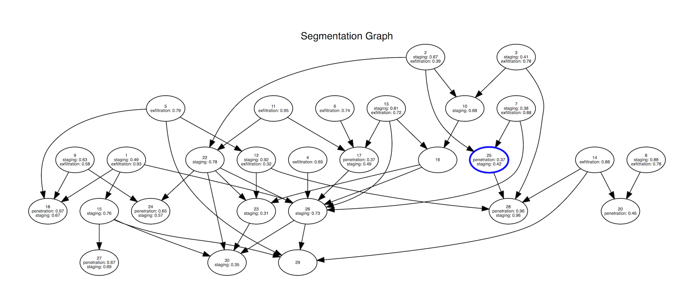
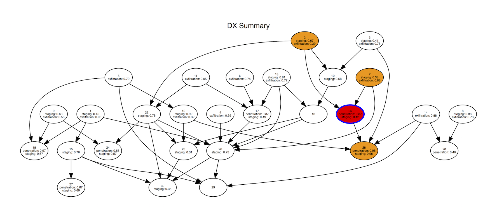
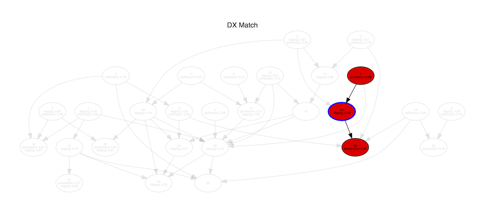

## Phase 1
The DX module generates a segmentation-level DAG, simulating the output of the segmenter, and
annotates the graph with APT grammar terminals, simulating the output of the classifier. Given an
APT campaign grammar and a symptomatic node, the module produces a list of paths through the symptom
that match the grammar.

## Dependencies
* Python 2.7
* [Virtualenv](https://virtualenv.pypa.io/)
* [Graphviz](http://www.graphviz.org/)

## Usage
The DX module uses `make` for building and running.
`make help` provides a detailed list on all available `make` targets:

```
$ make help
Available targets:
all             Default target. Same as 'make run'.
run             Run entrypoint: sim.py.
pdf             Generate DX report in PDF format.
test            Run tests.
coverage        Generate coverage report.
coverage-html   Generate HTML coverage report.
check           Run PEP8 style check.
d3              Generate data to d3 viz: open viz/index.html to see the report (WIP).
upreqs          Update requirements.txt file by running 'pip freeze'.
help            Display this help text.
```

## Configuration
Configurations are specified in the file `dx.yml`, and consist of three sections:
* `grammar` - where the APT grammar is specified.
* `simulation` - settings to guide the segmentation graph simulation.
* `diagnosis` - setting to guide the diagnosis.

An example configuration is as follows:

```yaml
grammar:
    - sequence:
        rules:
        - optional:
            rules:
            - 'penetration'
        - 'staging'
        - choice:
            label: 'exfiltration'
            rules:
                - 'tcp_exfil'
                - 'udp_exfil'

simulation:
    link_probability: 0.10
    ranks: [6, 8]
    per_rank: [4, 5]
    seed: 0

diagnosis:
    symptoms: [25]
```

### Grammar Section
* **Production Rules** have a `rules:` member that specifies all child productions of said rule.
 Rules can also have an optional `label:` member, so that they can behave like a terminal.
 Implemented rules are:
 * `sequence`
 * `choice`
 * `optional`
 * `one_or_more`
 * `zero_or_more`
* **Terminals** are denoted by a string (*e.g.* `'exfiltration'`).

### Simulation Section
* `link_probability` probability of creating an edge between two nodes of different rank.
* `ranks` number of ranks of nodes. Specified as a range.
* `per_rank` number of nodes per rank. Specified as a range.
* `seed` sets the random number generator seed.

### Diagnosis Section
Can have one of two members:
* `symptoms` a list of symptomatic nodes.
* `seed` sets the random number generator seed to randomly choose a symptomatic nodes.

## Example Output
Running `make pdf` with the default `dx.yml` configuration yields the following segmentation graph:



Each node is a segmentation node. Nodes can be connected via directed edges. The simulation also
annotates nodes with APT activity labels and respective classification confidence scores.
The node with the blue border is the symptomatic node.

The following page in the generated PDF document shows a reduced diagnosis. Nodes are colored
according to their frequency in diagnoses. The color mapping ranges from bright yellow (low
frequency) to bright red (high frequency). Nodes with no fill color did not appear in any set of
diagnostic candidates:



All of the following pages show a single path through the symptomatic node that was matched against
the APT grammar:



## Current limitations
* Only one symptom is supported at the moment.
* Anomaly scores are unused for diagnostic purposes.
